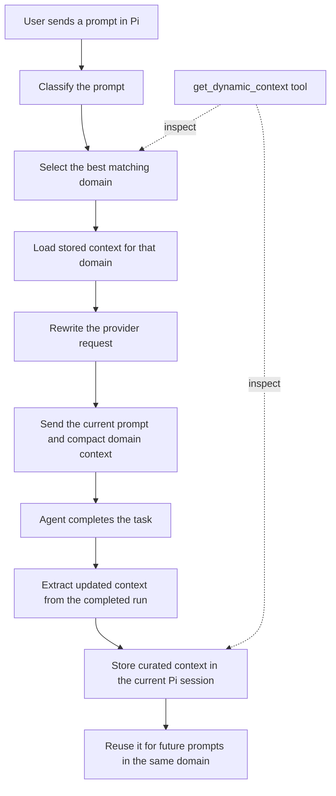

# pi-dynamic-context

A domain-aware context management extension for [Pi](https://pi.dev/).

`pi-dynamic-context` classifies each user prompt, retrieves the stored context relevant to that domain, and injects only that context into the model request. After the agent finishes, it extracts and stores updated context for future prompts in the same domain.

> **Status:** Alpha. Behavior, configuration, and stored-context formats may change.

## Why?

Long-running Pi sessions can accumulate information from unrelated tasks.

For example, the same session may contain:

- software architecture decisions;
- research notes;
- writing preferences;
- planning discussions;
- tool outputs from previous tasks.

Not all of this information is relevant to every new request. Reusing the entire conversation history can increase context size and introduce unrelated information into the current task.

`pi-dynamic-context` separates reusable context by domain.

When a new prompt arrives, the extension selects the most relevant domain and injects only the curated context stored for that domain.

## Example

Suppose a Pi session contains both coding and research work.

A new coding request does not necessarily need the previous research discussion.

Without domain-aware context selection:

```text
current coding prompt
+ previous coding discussion
+ previous research discussion
+ unrelated session history
→ model
```

With `pi-dynamic-context`:

```text
current coding prompt
+ curated coding context
→ model
```

The research context remains stored and can be reused when a later prompt belongs to the `research` domain.

## How it works



For every prompt, the extension performs two main operations:

### Before the model request

1. Classify the current prompt.
2. Select the best matching configured domain.
3. Retrieve the stored context for that domain.
4. Inject the current prompt and selected context into the provider request.

### After the agent run

1. Inspect the completed run.
2. Extract information that may be useful for future tasks in the selected domain.
3. Store the updated context as a custom entry in the current Pi session.

Previous conversation history is not automatically included when generating the updated domain context.

## Configured domains

The extension currently includes the following default domains in `domains.json`:

| Domain | Use case |
| --- | --- |
| `general` | General conversation or prompts that do not fit another configured domain. |
| `coding` | Writing code, debugging, refactoring, architecture, and code review. |
| `research` | Topic exploration, information gathering, literature review, analysis, and learning. |
| `writing` | Drafting, editing, proofreading, content creation, and document structuring. |
| `analysis` | Planning, strategic thinking, data interpretation, and problem decomposition. |

Domains are configuration-driven and can be changed or extended according to the user's workflows.

## Installation

```bash
pi install npm:@myriadcodelabs/pi-dynamic-context
```

Restart or reload Pi after installation.

The package manifest exposes `index.ts` as the Pi extension entry point.

## Features

- Automatically classifies each prompt into a configured domain.
- Injects only the stored context associated with the selected domain.
- Extracts updated context after each completed agent run.
- Stores curated domain context in the current Pi session.
- Keeps unrelated domain contexts separate.
- Provides a command and tool for inspecting the current state.

## Commands

### `/dynamic-context`

Displays the current extension status, including the selected domain and available stored context.

## Tools

### `get_dynamic_context`

Allows the assistant to inspect:

- the domain selected for the current prompt;
- the context stored for each configured domain;
- the current state of the extension.

## Current limitations

- Domain selection depends on the configured domain descriptions and classification behavior.
- Incorrect classification may cause relevant context to be omitted or unrelated context to be selected.
- Context extraction may lose details from earlier interactions.
- Stored context is scoped to the current Pi session.
- The extension is currently experimental and has not yet been extensively benchmarked.

## What this extension does not do

`pi-dynamic-context` does not:

- replace Pi's model provider;
- execute language models locally;
- manage model loading or inference;
- guarantee lower token usage for every workflow;
- preserve every detail from the original conversation history.

Its responsibility is limited to selecting, injecting, extracting, and storing compact domain-specific context.

## Preliminary evaluation

The extension was tested in a Penpot MCP agent using the DeepSeek-V4-Flash API. Two equivalent wireframe-generation tasks were executed with and without dynamic context enabled.

In these initial runs, enabling the extension reduced the input tokens included in the main agent request by approximately 90%, meaning that the request used roughly one-tenth as many input tokens. The generated wireframes remained usable, although minor visual-quality degradation was observed.

This was a small exploratory test involving only two prompts and no formal UI-quality rubric. The result should therefore be treated as preliminary rather than as a general performance benchmark.
